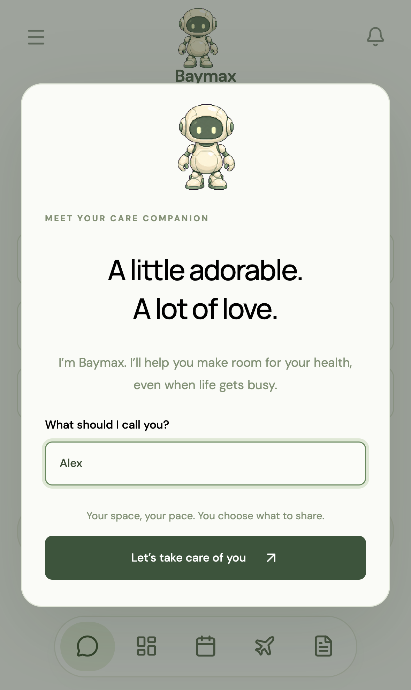
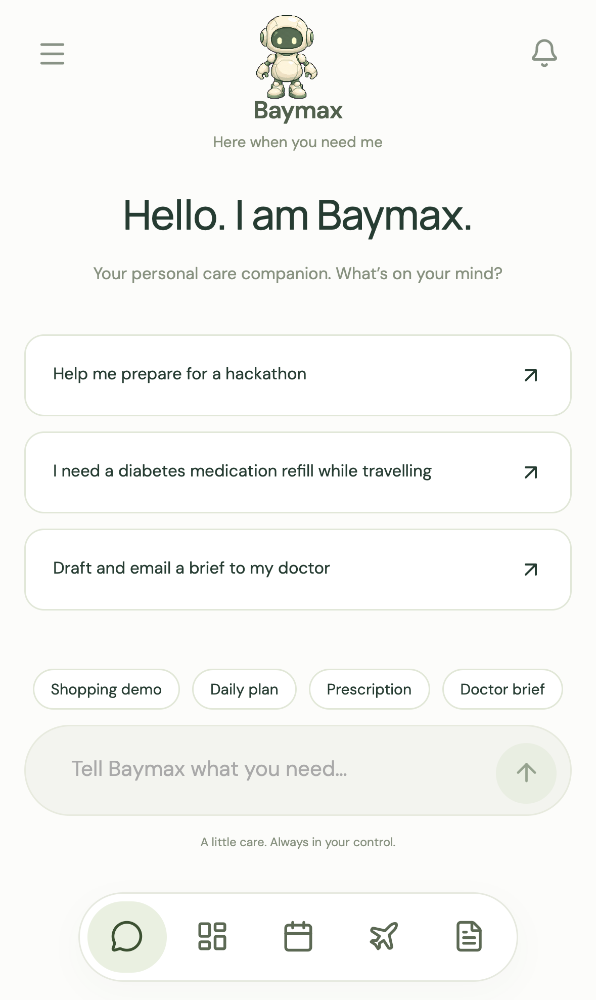
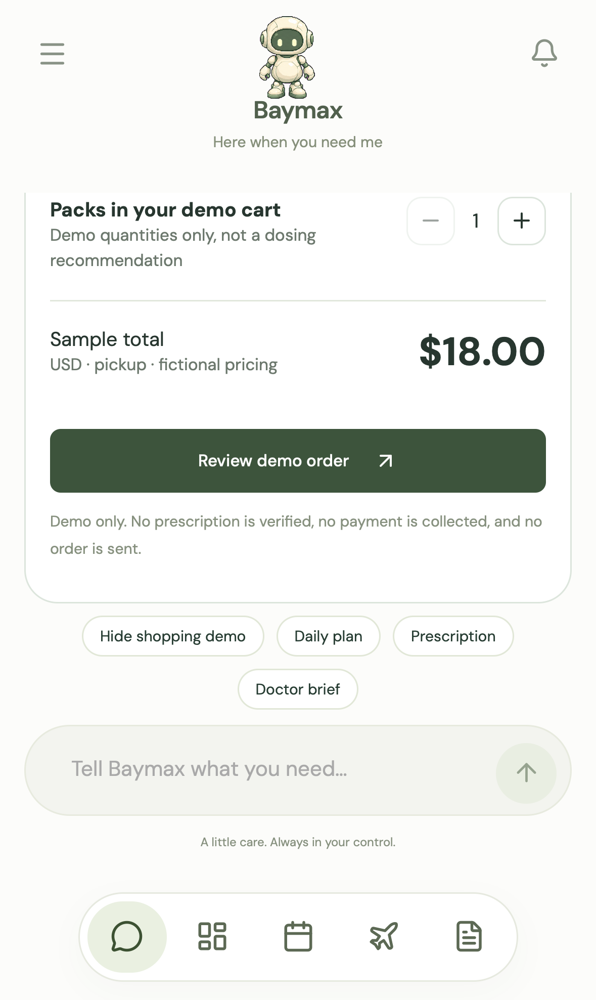
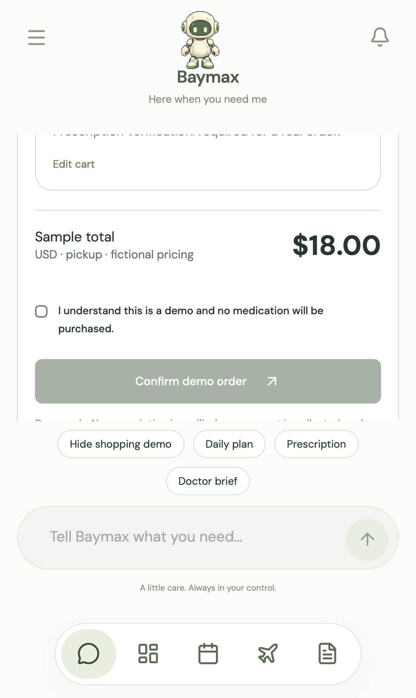
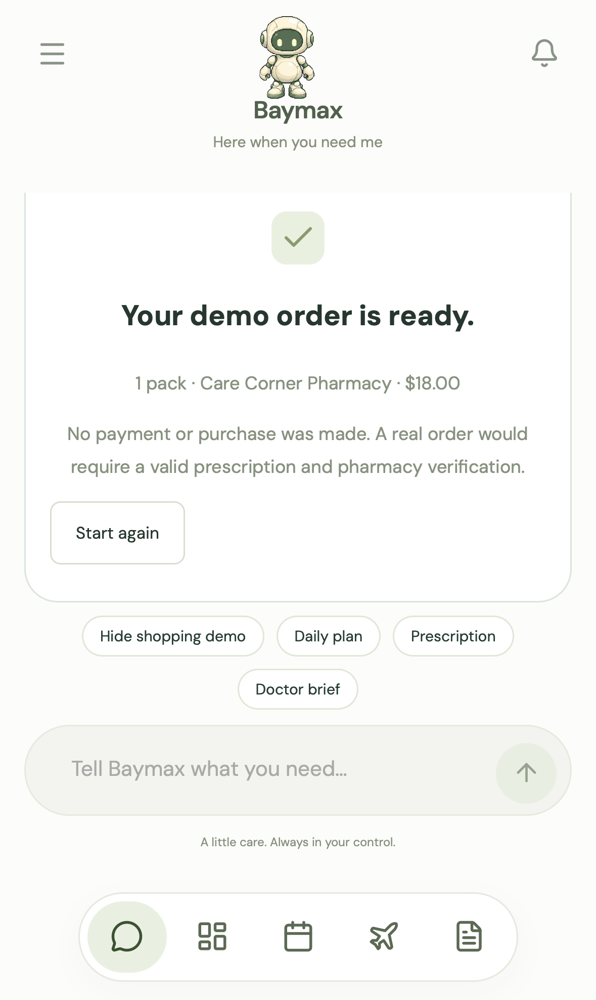

# Biobitworks Project 3 progress: offline-first + privacy compliance

Snapshot: 2026-10-04

Biobitworks owns the current GitHub Project work in:

- [#3 Offline-first AI](https://github.com/jerelvelarde/baymax-medical-pa/issues/3)
- [#4 Privacy compliance](https://github.com/jerelvelarde/baymax-medical-pa/issues/4)

This document records what is already executed or evidenced and what remains partial. It does **not** claim HIPAA compliance, clinical correctness, a physical-iPhone run, or a live medication purchase.

## Status against the assigned tasks

| Task | Current status | Evidence already produced | Remaining gap |
| --- | --- | --- | --- |
| #3 Offline-first AI | **PARTIAL** | Governed synthetic offline travel bundle; Swift bundle loader; deterministic compliance policy; persistent synthetic wallet; local Liquid model stress tests | Physical-iPhone end-to-end run; visible online/offline UX in the team app; on-device local inference/Apollo observation |
| #4 Privacy compliance | **PARTIAL** | Data-flow/compliance docs; deterministic routing; minimum-necessary FHIR/FCO derivation; sponsor-gap review; synthetic-only demo data; secret/PHI gates; human-approval wallet path | Unified consent UX; deletion exercised end to end; retention enforcement; final integrated app evidence |

## Custody/evidence milestones

The implementation/evidence work is maintained on `biobitworks/baymax-medical-pa` branches and is intentionally kept separate from the team UI until integration gates pass.

- **BP-0006 — local model stress test**
  - Liquid LFM2.5 350M / 1.2B / 2.6B executed locally.
  - Routing test result was negative on all three; deterministic policy remains authoritative.
  - Merkle root: `96016be790d7b5dfcd91cdea1db91482a2471ab747f4f8b5a5318ad4bb9d9ae8`.
- **BP-0007 / BP-0008 — synthetic agent wallet + custody hardening**
  - Ed25519 root/delegate model, bounded policy, human approval, replay/fork/rollback/tamper tests.
  - Fly delegate semantics are tested **in-process only**; a real Fly.io deployment remains `NOT_TESTED`.
  - Prescription purchase is prohibited in the wallet policy.
- **BP-0021 — pinned Synthea generation and actor admission**
  - Synthea v4.0.0, OpenJDK 17, explicit seed/clinician seed/reference date.
  - Two generated FHIR runs were byte-identical.
  - Actor-admission Ed25519 signature verified; Git commit itself remains unsigned.
  - Merkle root: `df7dee178f825544bed92435634545c6504ba6b4075d4ea5c09686dfd34c7528`.
- **BP-0022 — demo acceptance-scope correction**
  - Optional sponsor integrations/certification do not block the synthetic offline demo.
- **BP-0023 — synthetic FHIR/FCO/FCG structure admission**
  - Current synthetic structure admitted with explicit `NOT_MAPPED`/`UNKNOWN` limits.
  - Merkle root: `95bc45c1bb3a1d8ede91e70d4ec51dbbd30d45e9b60cdf1776eba22a98525052`.
  - Clean pushed-head chain verification: `PASS` for consistency, 24 entries, chain head `d29cb8445fa3fa8825959e7ad5f55a16fbb2f5fbcb8d6742a3b5ab174a8a7cd8`.

Repository MMR remains `NOT_COMPUTED`. Merkle roots prove declared byte commitments, not medical truth or regulatory compliance.

## Mobile GUI evidence from current upstream main

PR #9 (sprite work) is already merged into `main`. Current upstream UI at commit `c117134d1ed502ec83c2bc9d4865be0f0ac87b82` was built successfully and exercised with Playwright WebKit using the **iPhone 15 Pro** device profile (`393×659` CSS viewport, `1179×1977` screenshots).

The automated interaction sequence was:

1. load the pushed app;
2. capture the welcome/onboarding modal;
3. complete onboarding;
4. open **Shopping demo**;
5. review the fictional prescription-refill cart;
6. accept the explicit demo-only consent;
7. confirm the demo order.

At the final step the UI states that no payment or purchase was made and that a real order would require a valid prescription and pharmacy verification.

### Captures

The capture metadata is in [`screenshots/playwright-mobile-capture.json`](screenshots/playwright-mobile-capture.json).

### Known browser-test gap

During the mobile browser run, the frontend made two requests to:

`/health/overview?days=7`

Both returned HTTP 500 because the health backend was not running in the isolated UI test worktree. The app still rendered and the client-side shopping demo completed. This is **not** evidence that issue #3's offline end-to-end acceptance criterion is complete; it is a visible integration gap to address in the offline UX.

## What is not yet complete

- Physical iPhone execution is `NOT_TESTED`.
- The WebKit/iPhone Playwright run is browser emulation, not physical-device evidence.
- On-device Liquid/Apollo inference is `NOT_TESTED`.
- Real Fly.io deployment is `NOT_TESTED`; only wallet delegate semantics are tested locally.
- Real PHI is not used in the public demo.
- No medication purchase, prescription issuance, dose change, or pharmacy verification is implemented.
- Clinical correctness and US Core conformance remain unverified.
- Consent is partial; deletion is documented but not yet exercised end to end.
- Sponsor HIPAA capability is not promoted into a Baymax HIPAA-compliance claim.

## Next integration target

The next team-visible slice should wire the already-produced offline bundle into the UI/physical iPhone path:

`synthetic Synthea evidence → DatasetSourceFCO → FCG → minimum-necessary offline bundle → deterministic compliance → local/offline UI → optional local model → guarded user action`

Cloud services remain optional execution substrates rather than the canonical source of truth.
